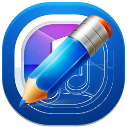

<h1 style="text-align: center;">Python Course</h1>

<div align="center">

  
  
  <p>
    Learning Python from scratch with Julio Arana Jr.
  </p>

<h4>
    <a href="https://github.com/julioaranajr/python-course/blob/main/course_content/00_COURSE_STRUCTURE.md">Course Content</a>
  <span> · </span>
      <a href="https://github.com/julioaranajr/python-course/blob/main/fundamentals/0_python_fundamentals.md">Fundamentals</a>
  <span> · </span>
    <a href="https://github.com/julioaranajr/python-course/blob/main/class_notes/0_class_notes.md">Class Notes</a>
  <span> · </span>
    <a href="https://github.com/julioaranajr/python-course/blob/main/exercises/0_exercises.md">Exercises</a>
  <span> · </span>
    <a href="https://github.com/julioaranajr/python-course/blob/main/resources/0_resources.md">Resources</a>
  </h4>

[![Contributors][contributors-shield]][contributors-url]
[![Forks][forks-shield]][forks-url]
[![Stargazers][stars-shield]][stars-url]
[![Issues][issues-shield]][issues-url]
[![MIT License][license-shield]][license-url]
[![LinkedIn][linkedin-shield]][linkedin-url]

</div>

<br />

# Table of Contents

- [About the Project](#about-the-repository)
  - [Tech Stack](#tech-stack)
  - [Features](#features)
- [Getting Started](#getting-started)
  - [Prerequisites](#prerequisites)
  - [Installation](#installation)
- [Usage](#usage)
- [Roadmap](#roadmap)
- [Contributing](#contributing)
- [Code of Conduct](#code-of-conduct)
- [License](#license)
- [Contact](#contact)
- [Acknowledgements](#acknowledgements)

<br>

## About the Repository

This repository contains the code for the Python Course by Julio Arana Jr. The course is designed to help you learn Python from scratch. The course is divided into multiple sections, each covering a different aspect of Python programming.

<br>

### Tech Stack

This project uses the following technologies:

- Python version 3.10.12
- Visual Studio Code
- Notepad++ version 8.6.8
- Markdown
- HTML

<br>

### Features

- [**Fundamental Python Programming**](/fundamentals/0_python-fundamentals.md)
- [**Class Notes**](/class_notes/0_class_notes.md)
- [**Exercises and Examples**](/exercises/0_exercises.md)
- [**Resources, References and Methods**](/resources/0_resources.md)

<br>

## Getting Started

Start with the fundamentals of Python programming. Learn the basics of Python programming, including data types, functions, loops, and more.

In the exercises section, you will find a collection of Python exercises to help you practice Python programming.

In the resources section, you will find a collection of resources, references, and methods to help you learn Python programming.

<br>

### Prerequisites

Before you begin, ensure you have met the following requirements:

- You have a `<Windows/Linux/Mac>` machine.
- You have installed the latest version of Python.
- You have a text editor or IDE installed on your machine.
- Visual Studio Code is recommended.

<br>

### Installation

- To install Python, please follow the instructions of the official Python website.
  - [Python Installation](https://www.python.org/downloads/)

- To install Visual Studio Code, please follow the instructions on the official Visual Studio Code website.
  - [Visual Studio Code Installation](https://code.visualstudio.com/)

- Install the Python extension for Visual Studio Code.
  - [Python Extension](https://marketplace.visualstudio.com/items?itemName=ms-python.python)

- Install the most popular python extension for Visual Studio Code.
  - [Python Extension Pack](https://marketplace.visualstudio.com/items?itemName=donjayamanne.python-extension-pack)

<br>

## Usage

Use this repository to learn Python programming from scratch. The course is designed to help you learn Python programming in a fun and interactive way.

<br>

### Clone the Repository

- Create a local Directory on your machine.<br>
  - e.g. on Windows:<br>`C:\Users\username\Documents\PythonCourse`
  - e.g. on Linux:<br> `~/Documents/PythonCourse`
- Open a terminal or command prompt. in the directory you created.

  ```bash
  Windows:
  cd C:\Users\username\Documents\PythonCourse
  ```

  ```bash
  Linux or Mac:
  cd ~/Documents/PythonCourse
  ```

- To clone the repository using `SSH`, run the following command:

  ```bash
  git clone git@github.com:julioaranajr/python-course.git
  ```

- To clone the repository using `HTTPS`, run the following command:

  ```bash
  git clone https://github.com/julioaranajr/python-course.git
  ```

<br>

## Roadmap

- [x] Add Fundamental Python Programming
- [x] Add Resources, References and Methods
- [x] Have fun with Python
- [ ] Exercises and Examples
- [ ] Hands-on Projects

<br>

## Contributing

<a href="https://github.com/julioaranajr/python-course/graphs/contributors">
  
</a>

**Contributions are always welcome!**

See [CONTRIBUTING](CONTRIBUTING.md) to find ways to get started.

<br>

## Code of Conduct

Code of Conduct is a set of rules and guidelines that outline the norms, rules, and responsibilities of an individual or organization.

Please read the [Code of Conduct](CODE_OF_CONDUCT.md)

<br>

## FAQ

- What is Python?

  - Python is a high-level, interpreted, interactive, and object-oriented scripting language. Python is designed to be highly readable. It uses English keywords frequently where other languages use punctuation, and it has fewer syntactical constructions than other languages.

- Why Python?

  - Python is a versatile language that can be used for a wide range of applications. It is easy to learn and use, making it an ideal language for beginners. Python is also a powerful language that can be used for complex applications, making it a popular choice for experienced developers.

- How can I learn Python?
  
  - There are many resources available for learning Python, including online tutorials, books, and courses. The Python website also has a wealth of information for beginners, including a tutorial and documentation.

<br>

## License

Distributed under the no License. See [LICENSE](LICENSE) for more information.

<br>

## Contact

Julio Arana Jr. - [@julioaranajr](https://twitter.com/julioaranajr) - info@julioaranajr.com

Project Link: [https://github.com/users/julioaranajr/project/](https://github.com/users/julioaranajr/projects/5)

<br>

## Acknowledgements

Use this section to mention useful resources and libraries that I have used in this projects.

- [Python Documentation](https://docs.python.org/3/)
- [w3schools](https://www.w3schools.com/python/)
- [Real Python](https://realpython.com/)
- [Geeks for Geeks](https://www.geeksforgeeks.org/)
- [Stack Overflow](https://stackoverflow.com/)
- [Awesome README](https://github.com/matiassingers/awesome-readme)
- [Shields.io](https://shields.io/)
- [Emoji Cheat Sheet](https://github.com/ikatyang/emoji-cheat-sheet/blob/master/README.md#travel--places)

<!-- MARKDOWN LINKS & IMAGES -->
<!-- https://www.markdownguide.org/basic-syntax/#reference-style-links -->
[contributors-shield]: https://img.shields.io/github/contributors/julioaranajr/python-course.svg?style=for-the-badge
[contributors-url]: https://github.com/julioaranajr/python-course/graphs/contributors
[forks-shield]: https://img.shields.io/github/forks/julioaranajr/python-course.svg?style=for-the-badge
[forks-url]: https://github.com/julioaranajr/python-course/network/members
[stars-shield]: https://img.shields.io/github/stars/julioaranajr/python-course.svg?style=for-the-badge
[stars-url]: https://github.com/julioaranajr/python-course/stargazers
[issues-shield]: https://img.shields.io/github/issues/julioaranajr/python-course.svg?style=for-the-badge
[issues-url]: https://github.com/julioaranajr/python-course/issues
[license-shield]: https://img.shields.io/github/license/julioaranajr/python-course.svg?style=for-the-badge
[license-url]: https://github.com/julioaranajr/python-course/blob/master/LICENSE.txt
[linkedin-shield]: https://img.shields.io/badge/-LinkedIn-black.svg?style=for-the-badge&logo=linkedin&colorB=555
[linkedin-url]: https://linkedin.com/in/julioarana
